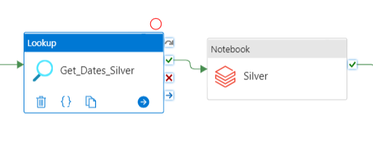

# Sunrise ERP GL Silver Layer

The silver layer is where the business rules and major transformations are applied. After the data get loaded into the bronze layer, the next step is to get the desired dates and pass all the parameters needed to run the notebook. The Silver ADF step can be seen below:

<figure><figcaption></figcaption></figure>

<figure><figcaption></figcaption></figure>

## Step 1: Get\_Dates

The Get\_Dates activity will trigger a procedure in our Trinity SQL Database. As result, the SQL procedure will give the Year/Months in _YYYYMM_ format, which will be later passed into the Silver notebook as parameters. You can see bellow the Input and Output for this activity below :



```python
 {
    "source": {
        "type": "AzureSqlSource",
        "sqlReaderStoredProcedureName": "[dbo].[GetDates_array]",
        "storedProcedureParameters": {
            "EndDate": {
                "type": "String",
                "value": ""
            },
            "StartDate": {
                "type": "String",
                "value": ""
            }
        },
        "queryTimeout": "02:00:00",
        "partitionOption": "None"
    },
    "dataset": {
        "referenceName": "ds_trinity_config_framework",
        "type": "DatasetReference",
        "parameters": {}
    },
    "firstRowOnly": false
}
```



```python
{
	"count": 1,
	"value": [
		{
			"YearMonths": "202301,202302"
		}
	],
	"effectiveIntegrationRuntime": "AutoResolveIntegrationRuntime (North Europe)",
	"billingReference": {
		"activityType": "PipelineActivity",
		"billableDuration": [
			{
				"meterType": "AzureIR",
				"duration": 0.016666666666666666,
				"unit": "DIUHours"
			}
		]
	},
	"durationInQueue": {
		"integrationRuntimeQueue": 0
	}
}
```



### Step 2 : Run Silver Notebook

The next step of the pipeline is to execute the databricks  Sunrise Finance GL notebook, located at `data_processing/finance_gl/silver_sunrise_finance_gl`. Taking the input inserted into this part of the process from ADF is possible to see that the country\_code, history, and year\_month variables created previously are used here as inputs in the notebook parameters:

```python
{
    "notebookPath": "/Repos/project-common-integration/trinity-common-integration-databricks/data_processing/finance_gl/silver_sunrise_finance_gl",
    "baseParameters": {
        "country_code": "AR",
        "year_month": "202301,202302"
    }
}
```

After that, the data cleaning, business rules, and transformations will start following the steps highlighted in the figure below. Let's discuss each step in detail to explain how the script works and why some joins\rules are needed.

<figure><figcaption></figcaption></figure>

#### Step 2.1: Read Bronze Tables and Configuration Tables

After collecting the _country\_code_ and _year\_month_ variables inputted into the notebook parameter and initializing some configurations (such as the database name and table name used to save the silver delta table later), the script will start to read all the configuration and source tables needed to perform the transformations. Follows a table showing each bronze table read, the PySpark DataFrame created, and a brief description.

| Delta Table Location                                         | DataFrame Created                | Description                                                                                                                                                                                                                                                                                                      |
| ------------------------------------------------------------ | -------------------------------- | ---------------------------------------------------------------------------------------------------------------------------------------------------------------------------------------------------------------------------------------------------------------------------------------------------------------- |
| bronze\_finance.sunrise\_finance\_gl                         | df\_sunrise                      | A Table containing the **Finance GL data** for all Sunrise markets including **all periods** available in the Source. **Extracted from** `_SYS_BIC."ZMJNRB.ZRTR_RB/CV_RTR_FI_GL_001"`                                                                                                                            |
| bronze\_master\_data.fusion\_mra\_map\_sunrise               | df\_mra\_map\_sunrise            | <p>A Table from Fusion containing the relation between Comp Code and Profit Centre used to Map the MRAs.</p><p><strong>"_SYS_BIC"."ZMJNRB_ADF_OTC.ZMD/CV_CUST_HIER1"</strong></p>                                                                                                                                |
| bronze\_master\_data.fusion\_group\_company\_code            | df\_fusion\_group\_company\_code | A Table containing the relation between the Legal Entity Code, Entity Currency, Entity Country, and Group Company Codes, **used to get the Group Company Code**. **Extracted from ZFI\_D\_CV\_GRCOMPC** Fusion Table.                                                                                            |
| bronze\_primary\_sales.config\_sunrise\_mra\_to\_companycode | df\_sunrise\_mra\_compc          | A Static Table containing the relation between the MRA Code and Group Company Code                                                                                                                                                                                                                               |
| silver\_master\_data.dimension\_product                      | df\_dim\_product                 | <p>A Table containing the information about all the Product Code and lob. Extracted from</p><p><strong>for product sku code: "_SYS_BIC"."ZFUSION.GlobalApps/ZFI_D_CV_GMATERIAL"</strong></p><p><strong>for lob:</strong></p><p><strong>"_SYS_BIC"."ZFUSION.GlobalApps/ZFI_D_CV_GLOB"</strong></p>                |
| bronze\_finance.fusion\_fpi\_value                           | df\_fpi\_value                   | A Table containing the information about all the FPI Codes and their description and the ZSign of the FPI.                                                                                                                                                                                                       |
| bronze\_finance.fusion\_fpi\_account\_map                    | df\_fpi\_account\_map            | A table containing the relation between the FPI code and Group accounts associated.                                                                                                                                                                                                                              |
| gold\_master\_data.dimension\_uom                            | df\_dimension\_uom               | <p>A Table containing the information about all the Product Code.</p><p><strong>Extracted from</strong></p><p><strong>for product sku code: "_SYS_BIC"."ZFUSION.GlobalApps/ZFI_D_CV_GMATERIAL"</strong></p><p><strong>for lob:</strong></p><p><strong>"_SYS_BIC"."ZFUSION.GlobalApps/ZFI_D_CV_GLOB"</strong></p> |

#### Step 2.2: Processing Data

Here we first create the MRA mapping rules. The code will define three DataFrames, mra\_sunrise\_mapping\_1, mra\_sunrise\_mapping\_2, and mra\_sunrise\_mapping\_3 which are used as a backup or default option in the event that more specific values are not found for the "GMRA" column. These DataFrames are created by selecting rows from the df\_mra\_map\_sunrise DataFrame where the "LRCOMPC" and "LPROFIT\_C" columns are either filtered based on their values or not.

* **mra\_sunrise\_mapping\_1**: This DataFrame provides default values for the "GMRA" column when more specific values are not found for a given combination of "COMP CODE" and "PROFIT CENTER" values.
* **mra\_sunrise\_mapping\_2**: This DataFrame provides default values for the "GMRA" column when more specific values are not found for a given "PROFIT CENTER" value.
* **mra\_sunrise\_mapping\_3**: This DataFrame provides default values for the "GMRA" column when more specific values are not found for a given "COMP CODE" value2

```python
// cmd 12
# Mapping Table used to derive the MRA with COMP CODE + PROFIT CENTER
mra_sunrise_mapping_1 = (
    df_mra_map_sunrise
    .select(*[F.trim(F.col(i)).alias(i) for i in df_mra_map_sunrise.columns]) # Trims all the columns
    .withColumn("row_number", F.row_number().over(W.partitionBy(F.col("LRCOMPC"),F.col("LPROFIT_C")).orderBy(F.col("ZDATETO").desc())))
    .filter("row_number == 1")
    .drop("row_number")
)

# Mapping Table used to derive the MRA with PROFIT CENTER
mra_sunrise_mapping_2 = (
    df_mra_map_sunrise
    .select(*[F.trim(F.col(i)).alias(i) for i in df_mra_map_sunrise.columns]) # Trims all the columns
    .filter(F.col("LRCOMPC") == F.lit("ALL"))
    .withColumn("row_number", F.row_number().over(W.partitionBy(F.col("LPROFIT_C")).orderBy(F.col("ZDATETO").desc())))
    .filter("row_number == 1")
    .drop("row_number")
)

# Mapping Table used to derive the MRA with COMP CODE
mra_sunrise_mapping_3 = (
    df_mra_map_sunrise
    .select(*[F.trim(F.col(i)).alias(i) for i in df_mra_map_sunrise.columns]) # Trims all the columns
    .filter(F.col("LPROFIT_C") == F.lit("ALL"))
    .withColumn("row_number", F.row_number().over(W.partitionBy(F.col("LRCOMPC")).orderBy(F.col("ZDATETO").desc())))
    .filter("row_number == 1")
    .drop("row_number")
)yy
```

The mapping logic is hierarchical, that the first mapping (mra\_sunrise\_mapping\_1) is checked first, followed by the second mapping(mra\_sunrise\_mapping\_1) if necessary, and then the third mapping (mra\_sunrise\_mapping\_1) if necessary. It means that the more specific mapping (i.e., those that filter on more columns) will be checked first and will take precedence over the less specific mapping if there is a match.

#### step 2.3: Data Transformations

The transformations are applied as below:

1. Trim is performed on all the columns and filtered on the year month taken from the parameters.
2. The dataframe which holds the data taken from Bronze **df\_sunrise** is made a left join with mra\_sunrise\_mapping\_1 created above on profit center and comp code.
3. A left join is then performed with mra\_sunrise\_mapping\_2 on Profit center.
4. It is then Joined left with mra\_sunrise\_mapping\_3 on Comp Code.&#x20;
5. An Inner join is made with **df\_sunrise\_mra\_compc** to fetch the local company code joining made on MRA Code.
6. left Join is made with **df\_fusion\_group\_company\_code** and **df\_dim\_product t**o map the local company code with the group company code. Join is made on comp code and Product code also filtering on the country code passed through the parameters.

```python
// cmd 13
df_silver_sunrise_prep = (df_sunrise
                      .select(*[F.trim(F.col(i)).alias(i) for i in df_sunrise.columns])
                      .filter(F.concat(F.expr("LEFT(PERIOD,4)"),F.expr("RIGHT(PERIOD,2)")).isin(year_month))
                      .alias("gl")
                      # Joins MRA Map table using the full key
                      .join(
                          mra_sunrise_mapping_1.alias("map_mra_1"),
                          [F.col("gl.PROFIT_CTR")==F.col("map_mra_1.LPROFIT_C"),F.col("gl.COMP_CODE")==F.col("map_mra_1.LRCOMPC")],
                          'left'
                      )
                      # Joins MRA Map table only using PROFIT CENTER
                      .join(
                          mra_sunrise_mapping_2.alias("map_mra_2"),
                          [F.col("gl.PROFIT_CTR")==F.col("map_mra_2.LPROFIT_C")],
                          'left'
                      )
                      # Joins MRA Map table only using COMP CODE 
                      .join(
                          mra_sunrise_mapping_3.alias("map_mra_3"),
                          [F.col("gl.COMP_CODE")==F.col("map_mra_3.LRCOMPC")],
                          'left'
                      )
                      # Gets the LOCAL COMPANY CODE
                      .join(
                          df_sunrise_mra_compc.alias("mapping_compc"),
                          [F.coalesce(F.col("map_mra_1.GMRA"),F.col("map_mra_2.GMRA"),F.col("map_mra_3.GMRA"))==F.col("mapping_compc.GMRA")],
                          'inner'
                      )
                      # Maps the LOCAL COMPANY CODE to the GROUP COMPANY CODE
                      .join(
                          df_fusion_group_company_code.alias("map_compc"),
                          [F.trim(F.col("mapping_compc.LRCOMPC"))==F.col("map_compc._BIC_LRCOMPC")],
                          'left'
                       )
                      .join(
                          df_dim_product.alias("dim_p"),
                          [F.col('gl.MATERIAL') == F.col('dim_p.product_code')],
                          'left'
                      )
                      .filter(F.trim(F.col("map_compc.COUNTRY")).isin(country_code))
                      .select(
                          F.coalesce(F.col("map_mra_1.GMRA"),F.col("map_mra_2.GMRA"),F.col("map_mra_3.GMRA")).cast("string").alias("mra_code"),
                          F.coalesce(F.col("map_compc._BIC_GRCOMPC"),F.lit("NA")).cast("string").alias("group_company_code"),
                          F.coalesce(F.col("mapping_compc.LRCOMPC"),F.lit("NA")).cast("string").alias("local_company_code"),
                          F.coalesce(F.col("dim_p.lob"),F.lit("NA")).cast("string").alias("lob"),
                          F.concat_ws("-",F.expr("LEFT(gl.PERIOD,4)"),F.expr("RIGHT(gl.PERIOD,2)"),F.lit("01")).cast("date").alias("date"),
                          F.concat(F.expr("LEFT(gl.PERIOD,4)"),F.expr("RIGHT(gl.PERIOD,2)")).cast("string").alias("year_month"),
                          F.col("map_compc.COUNTRY").alias("country_code"),
                          F.coalesce(F.col("gl.CUSTOMER_CODE"),F.lit("NA")).cast("string").alias("customer_code"),
                          F.coalesce(F.col("gl.LOC_CURRCY"),F.lit("NA")).cast("string").alias("currency_code"),
                          F.coalesce(F.col("gl.MATERIAL"),F.lit("NA")).cast("string").alias("product_code"),
                          F.coalesce(F.col("gl.PROFIT_CTR"),F.lit("NA")).cast("string").alias("profit_center"),
                          F.coalesce(F.col("gl.PROD_UOM_CODE"),F.lit("NA")).cast("string").alias("uom_code"),
                          F.coalesce(F.col("gl.LOCL_CRNCY_MO_AMNT"),F.lit(0.0)).cast("double").alias("local_crncy_mo_amnt"),
                          F.coalesce(F.col("gl.GL_ACCT_CODE"),F.lit("NA")).cast("string").alias("local_account"),
                          F.coalesce(F.col("gl.SHIP_TO_CUSTOMER"),F.lit("NA")).cast("string").alias("ship_to_customer"),
                          F.coalesce(F.col("gl.ACCOUNT_CODE"),F.lit("NA")).cast("string").alias("group_account"),
                          F.coalesce(F.col("gl.COST_CENTER_CODE"),F.lit("NA")).cast("string").alias("cost_center_code"),
                          F.coalesce(F.col("gl.SEGMENT_CODE"),F.lit("NA")).cast("string").alias("segment_code"),
                          F.coalesce(F.col("gl.BRAND_CODE"),F.lit("NA")).cast("string").alias("brand_code"),
                          F.coalesce(F.col("gl.UNITS"),F.lit(0.0)).cast("double").alias("units"),
                          F.coalesce(F.col("gl.FISCAL_YEAR"),F.lit("NA")).cast("string").alias("fiscal_year"),
                          F.coalesce(F.col("gl.FISCAL_YTD_VARNT"),F.lit("NA")).cast("string").alias("fiscal_ytd_varnt"),
                          F.col("gl.filename")
                      )
                     )

# df_silver_sunrise_prep.display()py
```

#### Step 2.4 : Transformations&#x20;

1. Casting is performed on columns and renaming of the columns using Alias is done, Coalesce function is used to handle the Null values.
2. The dataframe at this stage is joined with **df\_dimension\_uom** on Uom code and source.
3. &#x20;**** If Product code is NA from **df\_dimension\_uom**  then concatenation of product Code, Brand Code and Segment code from **df\_silver\_sunrise\_prep** is considered as Product code.

```python
// cmd 14
df_silver_sunrise = (df_silver_sunrise_prep
                         # Map the column rules 
                         .alias("gl")
                         .join(
                             df_dimension_uom.alias("dim_uom"),
                             [
                                F.col("gl.uom_code") == F.col("dim_uom.uom_code"),
                                F.col("dim_uom.source") == F.lit("Config" )
                             ],
                             'left'
                         )
                         .select(
                              F.col("gl.mra_code"),
                              F.col("gl.group_company_code"),
                              F.col("gl.local_company_code"),
                              F.col("gl.lob"),
                              F.col("gl.date"),
                              F.col("gl.year_month"),
                              F.col("gl.country_code"),
                              F.col("gl.customer_code"),
                              F.col("gl.currency_code"),
                              F.when(F.col("gl.product_code") == "NA", F.concat(F.col("gl.product_code"),F.col("gl.brand_code"),F.col("gl.segment_code"))
                                    ).otherwise(F.col("gl.product_code")).alias("product_code"),
                              F.col("gl.profit_center"),
                              F.col("gl.uom_code"),
                              F.when(F.col("gl.group_account") == "PL4999903",F.lit(0)
                                    ).otherwise(F.col("gl.local_crncy_mo_amnt")).alias("local_crncy_mo_amnt"),
                              F.col("gl.local_account"),
                              F.col("gl.ship_to_customer"),
                              F.when(F.col("gl.units") != 0, F.lit("PL49999903")
                                    ).otherwise(F.col("gl.group_account")).alias("group_account"),
                              F.col("gl.cost_center_code"),
                              F.col("gl.segment_code"),
                              F.col("gl.brand_code"),
                              F.when(F.col("gl.group_account") != "PL4999903",F.lit(0)
                                    ).otherwise(F.col("gl.units")
                              ).alias("units"),
                              F.col("gl.fiscal_year"),
                              F.col("gl.fiscal_ytd_varnt"),
                              F.col("gl.filename"),
                              F.current_timestamp().alias('load_timestamp'),
                              F.coalesce("dim_uom.uom_desc",F.lit("NA")).alias("uom_desc")
                         )         
                    )
```

#### Step 2.5: Columns Mapping and Fields Creation

| Source Table                                            | Source Column         | Silver Column          | Transformation                                                                                |
| ------------------------------------------------------- | --------------------- | ---------------------- | --------------------------------------------------------------------------------------------- |
| **"\_SYS\_BIC"."ZMJNRB\_ADF\_OTC.ZMD/CV\_CUST\_HIER1"** | GMRA                  | mra\_code              | Column created using the MRA Dynamic Mapping Rules                                            |
| ZFI\_D\_CV\_GRCOMPC (Fusion) or **Static Table.**       | \_BIC\_GRCOMPC        | group\_company\_code   | Column extracted from the join against the fusion\_group\_company\_code\_df DataFrame.        |
| ZFI\_D\_CV\_GRCOMPC (Fusion) or **Static Table.**       | \_BIC\_LRCOMPC        | local\_company\_cde    | Column extracted from the join against the fusion\_group\_company\_code\_df DataFrame.        |
| "\_SYS\_BIC"."ZFUSION.GlobalApps/ZFI\_D\_CV\_GLOB"      | \_BIC\_GLOB           | lob                    | Column extracted from the join against the df\_dim\_product DataFrame.                        |
| _Created at Processing_                                 |                       | date                   | Created using the column Period from Source,Trim and Cast to _date_                           |
| Created at processing                                   |                       | year\_month            | Created using the column Period from Source                                                   |
| ZFI\_D\_CV\_GRCOMPC (Fusion) or **Static Table.**       | COUNTRY               | country\_code          | <p>Column extracted from the join against t</p><p>fusion_group_company_code_df DataFrame.</p> |
| **Source Table**                                        | CUSTOMER\_CODE        | customer\_code         | Trim and Cast to _string_                                                                     |
| **Source Table**                                        | LOC\_CURRCY           | currency\_code         | Trim and Cast to _string_                                                                     |
| **Source Table**                                        | MATERIAL              | product\_code          | Trim and Cast to _string_                                                                     |
| **Source Table**                                        | PROFIT\_CTR           | profit\_center         | Trim and Cast to _string_                                                                     |
| **Source Table**                                        | PROD\_UOM\_CODE       | uom\_code              | Trim and Cast to _string_                                                                     |
| **Source Table**                                        | LOCL\_CRNCY\_MO\_AMNT | local\_crncy\_mo\_amnt | Trim and Cast to _double_                                                                     |
| **Source Table**                                        | GL\_ACCT\_CODE        | local\_account         | Trim and Cast to _string_                                                                     |
| **Source Table**                                        | SHIP\_TO\_CUSTOMER    | ship\_to\_customer     | Trim and Cast to _string_                                                                     |
| **Source Table**                                        | ACCOUNT\_CODE         | group\_account         | Trim and Cast to _string_                                                                     |
| **Source Table**                                        | COST\_CENTER\_CODE    | cost\_center\_code     | Trim and Cast to _string_                                                                     |
| **Source Table**                                        | SEGMENT\_CODE         | segment\_code          | Trim and Cast to _string_                                                                     |
| **Source Table**                                        | BRAND\_CODE           | brand\_code            | Trim and Cast to _string_                                                                     |
| **Source Table**                                        | UNITS                 | units                  | Trim and Cast to _double_                                                                     |
| **Source Table**                                        | FISCAL\_YEAR          | fiscal\_year           | Trim and Cast to _string_                                                                     |
| **Source Table**                                        | FISCAL\_YTD\_VARNT    | fiscal\_ytd\_varnt     | Trim and Cast to _string_                                                                     |
| **Source Table**                                        | filename              | filename               | Trim and Cast to _string_                                                                     |
| Created at processing                                   |                       | load\_timestamp        |                                                                                               |
| **raw/Config/config\_sap\_uom\_mapping**                |                       | UOM\_desc              |                                                                                               |

#### Step 2.6: Saving data to Silver Layer

Data obtained from the above step is now saved to the Silver Layer based on Group Company Code and Year month. Data which is already existing will be overwritten and and new file is created otherwise. Data is also written into Silver table **silver\_finance.sunrise\_finance\_gl** using the below code.

```python
// cmd 16
logging.info(f'Writing data to Silver Layer')

predicate_string = get_replace_statement(df_silver_sunrise,["group_company_code","year_month"])

(
    df_silver_sunrise
    .write
    .format('delta')
    .mode('overwrite')
    .option('path', silver_location)
    .option('replaceWhere', predicate_string)
    .partitionBy("group_company_code","year_month")
    .saveAsTable(f'{silver_database}.{silver_table_name}')
)
logging.info(f'Finished writing data to Silver Layer: {silver_database}.{silver_table_name}')
```
